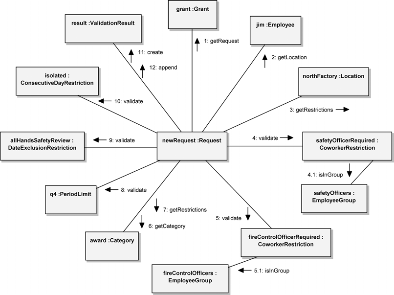
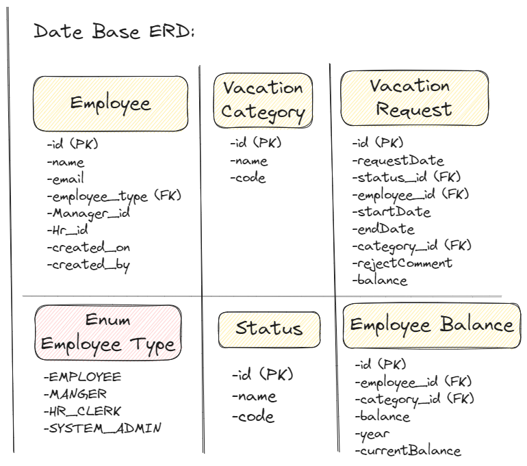
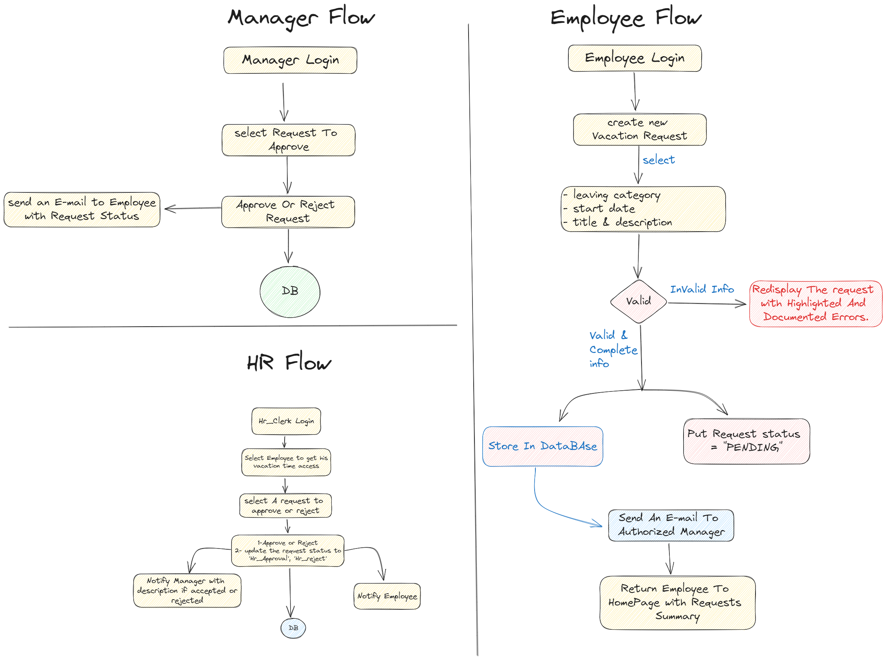
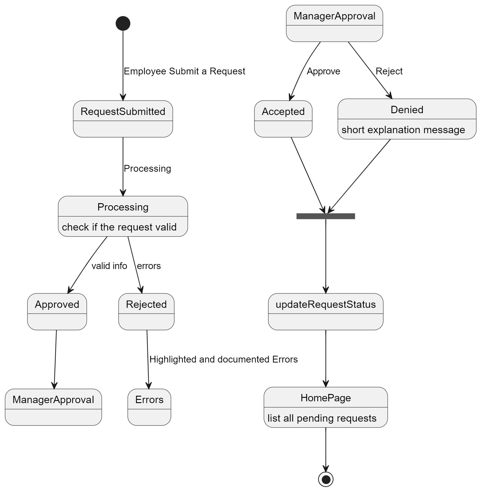
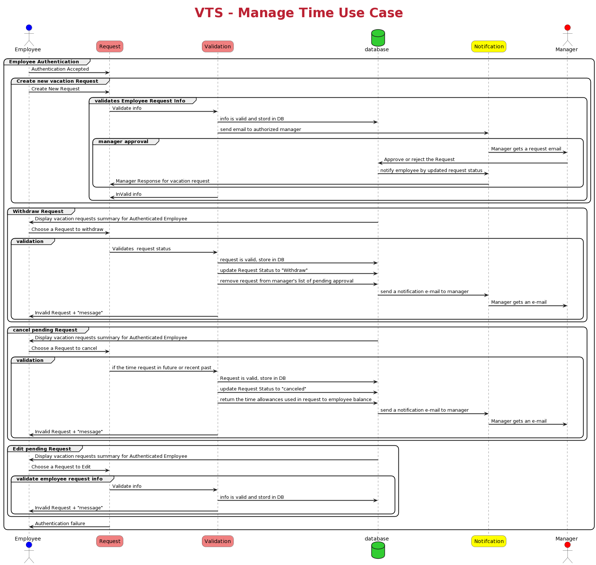

# Vacation Tracking System
## The Vacation Sysytem Idea is presented in Onject Oroentd Analysis And Design textbook, 3th edition. </b> I worked in designing the system work flow and defining it's use cases in details including Flow Diagram,State diagram, ERD Diagram. Also, I
## Index
- [System Features](#system-features)
- [All Possible Use Cases](#use-cases)
- [Manage Time Use Case Details](#manage-time-use-case)
   - [DataBase Design & Implemntation ](#high-level-database-design-for-the-system)
   - [Flow Diagrams](#flow-digrams)
   - [State Diagram](#state-diagram)
   - [Sequence Diagram ](#sequence-diagram)

## System goal : The system has the potential to save time and money mostly in the HR department
> We will take the rules from the Human Resources department, establish a system based on them, and the HR employee will be responsible for entering and updating the employees' vacation times and dates in the system
## system features :
1. Implementation flexible rules for validating and verifying leave time requests.
2. Enable manager approval.
3. Provide access for the previous 12 months and the next 6 Months.
4. Use email notification to notify the manager when a new request and the employee after response.
5. Enable the HR and System Admin to override all actions restricted by rules with logging of those overrides.
6. Allow managers to directly award personal leave time with system limits.
7. provide a UI to give the employee a vacation request summary.

### Use Case Actors:
1. Employee 
   1. manage time 
2. Manager   
   1. Approve or refuse Request
   2. Award time
3. HR Clerk   
   1. Edit Employee Records 
   2. Manage Locations 
   3. Manage leave Categories
   4. Override Leave Records
4. System Admin
   1. Back-Up System Logs

### Use Cases :

- [x] Manage Time [create new Request, Edit pending request, withdraw request, cancel Approved Request]
- [ ] Award Time
- [ ] Edit Employee Record
- [ ] Manage Locations
- [ ] Manage Leave categories
- [ ] Override Leave records
- [ ] Backup system Logs

## Manage Time Use Case 
### Main flow:
#### **preconditions** : The employee is authenticated to access  the vacation System with privileges to manage his vacation dashboard
1. The employee clicks on the link to access the vacation system.
2. The system uses Employee credentials to look up the current status of the employee's previous 12M and the next 6 months' vacations
3. The employee chooses to create a new vacation request.
4. The system asks the employee which data and time he wanted for the vacation
> The employee should have access to a **visual calendar** to help select and compare chosen dates.
5. The employee selects the desired dates and hours per data with a short title and description. Then submit the request.
6. If the submitted information is incomplete or incorrect or doesn't pass the validation, the app displays the request again with errors highlighted and documented
7. At this point, the employee can edit any info or cancel the request and remove all info.
8. if the request is submitted:
   * The employee is returned to the homepage which contains a vacation request summary.
   * If the employee’s vacation time requests require manager approval, an e-mail is immediately sent to the manager(s) authorized to approve the employee’s requests.
9. The request status should be updated to **pending**.
10. The manager responds to the e-mail by clicking on a link embedded in the e-mail or by explicitly logging into the System
11. The manager may be required to supply the necessary authentication credentials to gain access
12. The System home page lists the manager’s own vacation time requests and outstanding balances but also has a separate section listing requests pending approval by subordinate employees <b>The manager selects each of these one at a time to individually approve or deny.

 

    

A Communication Diagram Describing a Request Validation Collaborationt

### High-level Database Design for the system:
* Employee Table:[ EmployeeID (PK), FirstName, LastName, Email, Password, Role (Employee, Manager, HR Clerk, System Admin) ]
* Manager Table: [ ManagerID (PK), EmployeeID (FK) ]
* HR Clerk Table:[ HRClerkID (PK), EmployeeID (FK) ]
* LeaveCategory Table:[ CategoryID (PK), CategoryName, Description ]
* Location Table: [ LocationID (PK), LocationName, Description ]
* VacationRequest Table:[RequestID (PK), EmployeeID (FK), CategoryID (FK), LocationID (FK), StartDate, EndDate, StartTime, EndTime, Title, Description, Status (Pending, Approved, Denied), ManagerID (FK) ]
* OverrideLog Table: [ LogID (PK), Action (e.g., Edit Employee Record, Override Leave Record), EmployeeID (FK), Timestamp, Description ]
* SystemLog Table: [LogID (PK), Action (e.g., Backup System Logs), AdminID (FK referencing Employee Table), Timestamp, Description ]

    

Data-Base Digram

#### Now, let's explain how these tables are used in the context of the system's use cases:
* The Employee Table stores employee information, including their roles (Employee, Manager, HR Clerk, System Admin).
* The Manager Table and HR Clerk Table establish relationships between employees and their respective roles.
* The LeaveCategory Table stores information about different leave categories (e.g., vacation, personal leave).
* The Location Table stores information about different locations for vacation.
* The VacationRequest Table is the core table for tracking vacation requests. It includes details about the request, such as start and end dates, times, and status. It also references the employee making the request and, if applicable, the manager who approved it.
* The OverrideLog Table logs any actions where HR or System Admin overrides leave records.
* The SystemLog Table logs system-level actions like backups performed by the System Admin.

 
 

## Flow Diagrams 
> Here is the Flow Digrams for the Main Flow and the other alternative flows

 
 

System Actors Flow

## State Diagram

 
 

State Machine Diagram

## Sequence Diagram 

 
 

 Main and alternative Flow Sequence Diagram for

